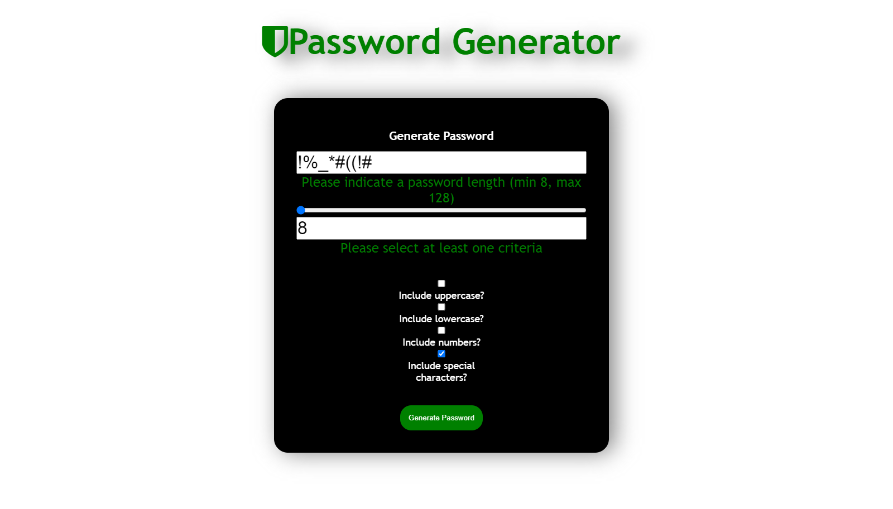
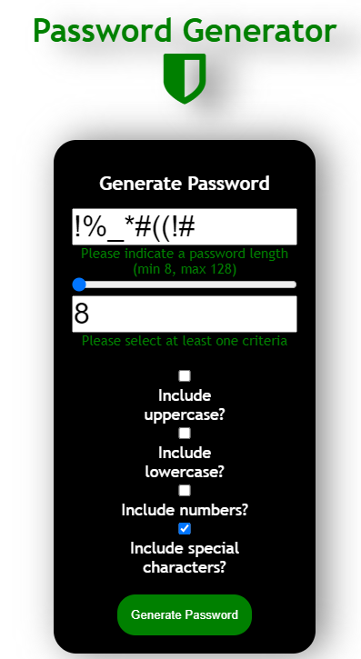

# Random Password Generator

## Link to deployed site:
https://ray0095.github.io/password-generator/ 

## Description 
The following files contain the necessary assets to deploy a functional random password generator. Using HTML, CSS, and JavaScript, the site allows users to choose a password length between 8 and 128 characters and select whether or not they'd like the password to include uppercase, lowercase, numbers, and/or special characters. 

## Table of Contents

* [Installation](#installation)
* [Features](#features)
* [Screenshots](#screenshots)

## Installation

To use this site for your own website or your client's website, follow these steps: 
    1. Fork this repo 
    2. Create a local clone of your fork 
    3. Save and deploy to your domain!

## Features

This site features usage of Javascript functions, arrays, variables, and a for loop that randomly selects characters from an array. The site is fully responsive and features some minor hovering effects. 

# Screenshots

